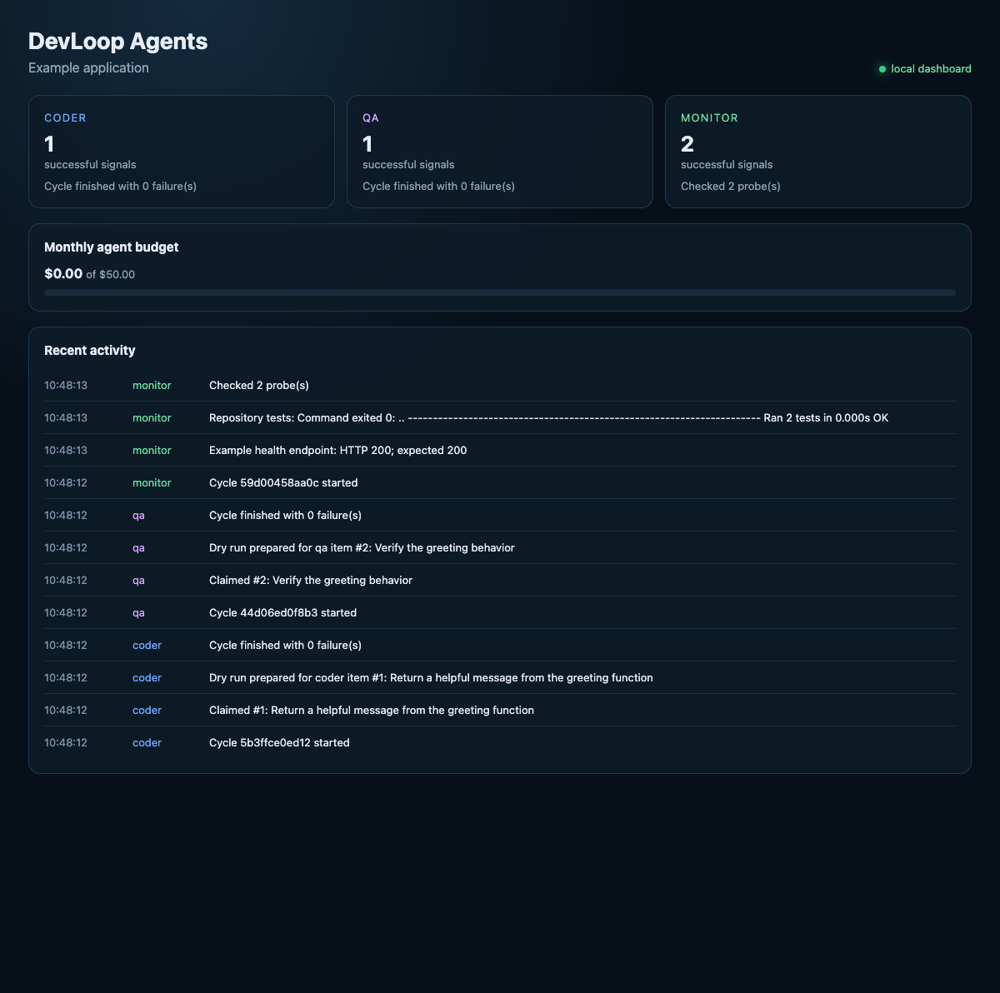
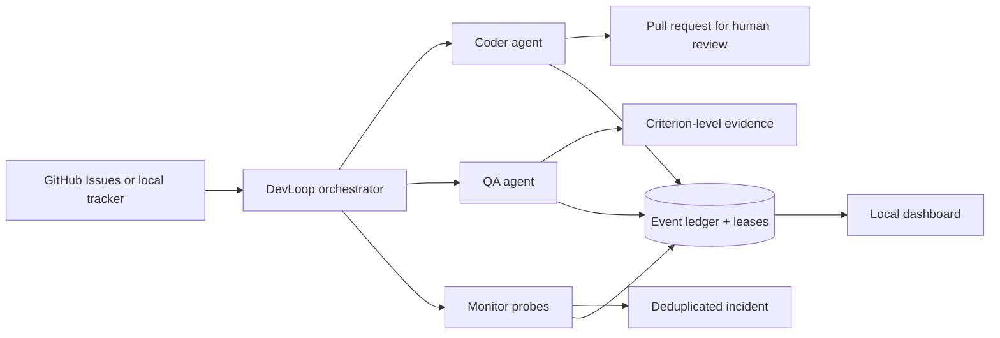

# DevLoop Agents

[](https://github.com/arminkhbwork/devloop-agents/actions/workflows/ci.yml)
[](https://www.python.org/downloads/)
[](LICENSE)

**A portable, observable control plane for AI coding, QA, and service-monitoring agents.**

DevLoop Agents turns issues and health signals into reviewable engineering work. It coordinates three focused roles through one configuration file, records every run in an append-only event ledger, prevents duplicate work with leases, and keeps merge and deployment decisions behind a human gate.

The project grew from a production automation system and was rebuilt as a standalone public toolkit. It has no dependency on a specific product, private Jira workspace, hosting platform, or AI provider.



[Explore the project case study](https://arminkhabazha.com/projects/devloop-agents).

## What it does

| Agent | Input | Work | Output |
|---|---|---|---|
| Coder | Labeled issue | Isolated implementation, checks, commit, pull request | Review-ready PR and issue evidence |
| QA | Labeled issue | Acceptance-criteria testing across code, APIs, browser, accessibility, and performance | Pass/fail evidence and workflow label |
| Monitor | HTTP or command probes | Health evaluation and incident deduplication | New incident or update to an existing incident |

The built-in dashboard shows recent activity, role health, failures, and monthly agent cost. The default configuration is a safe dry run, so setup can be validated before an agent or tracker is allowed to write anything.

## Design principles

- **Provider-neutral execution.** Any headless AI tool that reads a prompt from standard input can be used.
- **GitHub-native by default.** GitHub Issues provide the queue and workflow state. A local JSON tracker supports offline evaluation and demos.
- **Human-controlled delivery.** Agents may open pull requests; automatic merge and deployment are rejected by configuration validation.
- **Evidence over claims.** QA prompts require criterion-level evidence and reproducible failures.
- **Operational visibility.** Structured JSONL events, cost fields, leases, and the dashboard make unattended cycles inspectable.
- **Safe failure.** Timeouts, budget caps, deduplicated incidents, secret redaction, and one-item leases limit blast radius.

## Architecture



Read [the architecture guide](docs/architecture.md) for lifecycle and extension details.

## Try it without accounts or tokens

Requirements: Python 3.11 or newer.

```bash
git clone https://github.com/arminkhbwork/devloop-agents.git
cd devloop-agents
python -m venv .venv
source .venv/bin/activate
pip install -e .

devloop --config config/devloop.example.toml doctor
devloop --config config/devloop.example.toml run coder
devloop --config config/devloop.example.toml run qa
devloop --config config/devloop.example.toml run monitor
```

Without `--apply`, every role is read-only. The coder and QA print the task they would send to the configured AI tool; the monitor executes only the configured probes and does not create incidents.

Start the local dashboard:

```bash
devloop --config config/devloop.example.toml dashboard
open http://127.0.0.1:8765
```

## Connect a real GitHub project

Create a starter file inside the target repository:

```bash
devloop init
```

Edit `devloop.toml`:

```toml
[project]
name = "My application"
workspace = "."
default_branch = "main"
target_url = "https://staging.example.com"

[tracker]
provider = "github"
repository = "your-org/your-repo"
token_env = "GITHUB_TOKEN"
publish_agent_output = false

[runner]
provider = "command"
command = ["codex", "exec", "--full-auto", "-"]
timeout_seconds = 1800
pass_env = ["PATH", "LANG", "LC_ALL", "TMPDIR", "OPENAI_API_KEY"]
```

Set a fine-grained GitHub token with access only to the selected repository. It needs Issues read/write access; the selected coding agent may also need Contents and Pull Requests access to create its branch and PR.

```bash
export GITHUB_TOKEN="..."
devloop doctor
devloop run coder              # dry run, even with a real tracker
devloop run coder --apply      # claims one issue and executes the agent
```

Queue work by applying labels:

- `agent:code` sends an issue to the coding queue.
- `agent:qa` sends an issue to the QA queue.
- Monitor incidents receive `agent:incident` and `agent:monitor`.

All labels are configurable. See [integration guide](docs/integrations.md).

## Bring your own AI coding agent

The command runner deliberately avoids a hard dependency on one vendor. Configure an executable and arguments as an array; DevLoop sends the complete role prompt through standard input and runs the process in the project workspace.

The agent should end with a single structured line:

```text
DEVLOOP_RESULT: {"status":"completed","summary":"Implemented validation and opened PR","pull_request_url":"https://github.com/org/repo/pull/42","cost_usd":0.18,"turns":7}
```

If the line is missing, DevLoop still records the run output locally. Structured results improve status updates, cost tracking, and the dashboard. Model-generated output is not posted to GitHub by default. DevLoop also excludes the tracker token from the agent process; configure a separate least-privilege credential if the coding tool needs to push a branch or open a PR.

## Run continuously

```bash
devloop run coder --loop --apply
devloop run qa --loop --apply
devloop run monitor --loop --apply
```

For containerized operation, copy `.env.example` to `.env`, set the absolute project path and token, adapt `devloop.toml` paths to `/workspace` and `/data`, then start the services:

```bash
docker compose up --build -d
```

The dashboard binds to `127.0.0.1:8765` by default. Do not expose it publicly without authentication and TLS.

## Safety model

DevLoop rejects configurations that enable automatic merge or deployment. Its coding prompt requires a branch or worktree and a pull request. The QA role is instructed not to modify application code. The monitor only creates or updates incidents after a configured probe fails and uses a stable fingerprint to avoid duplicates.

These controls reduce risk, but the configured AI command still runs with the operating-system permissions you give it. Use repository-scoped credentials, an isolated workspace or container, protected branches, required CI checks, and pull-request approval rules. See [security and safety](docs/safety.md).

## Development

```bash
python -m unittest discover -s tests -v
python -m compileall -q src tests
```

The CI workflow runs the test suite, package build, and a credential-pattern scan on every push and pull request.

## Project status

DevLoop Agents is an early public release. The local and GitHub trackers, command runner, leases, probes, event ledger, budget guard, and dashboard are implemented. Good next contributions include GitLab and Jira adapters, OpenTelemetry export, richer policy engines, and signed agent artifacts.

## License

MIT License. See [LICENSE](LICENSE).
