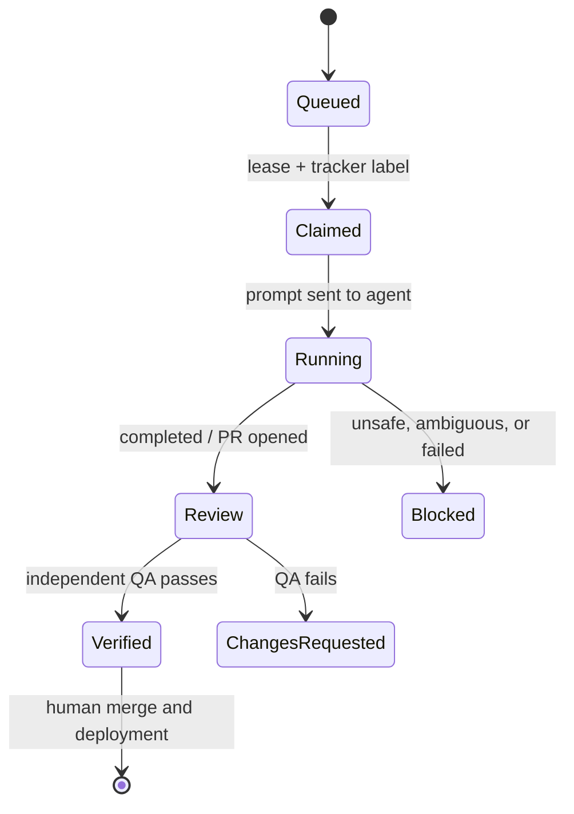

# Architecture

DevLoop is a small control plane around external AI agents. It owns scheduling, work claiming, policy, tracker transitions, health probes, and telemetry. The configured AI command owns reasoning and repository changes.

## Components

### Orchestrator

`Orchestrator` runs one bounded cycle or a continuous polling loop. A cycle reads at most `max_items_per_cycle`, acquires an item lease, optionally claims it in the tracker, renders a role prompt, executes the agent, posts the result, and records structured events.

### Tracker adapters

The `Tracker` protocol separates workflow logic from the issue system. The local adapter stores issues in JSON for offline evaluation. The GitHub adapter treats labels as explicit workflow states and uses the GitHub REST API directly.

New adapters implement five methods: queue, claim, complete, fail, and report_incident. They should preserve unrelated labels and use an idempotent incident fingerprint.

### Agent runner

The command runner accepts an argument array, never a shell string. It sends a complete prompt through standard input, executes in the configured workspace, enforces a timeout, captures output, and parses an optional `DEVLOOP_RESULT` record.

This boundary supports hosted, local, and subscription-backed agent CLIs without putting provider credentials or SDK code inside DevLoop.

### Leases and event ledger

SQLite leases ensure only one process works a role/item pair at a time. Expired leases recover automatically after a crashed process. The JSONL event ledger is append-only and tolerant of a partial final line. It provides a stable input for the dashboard and future observability exporters.

### Monitor

HTTP probes validate response status. Command probes run project-defined checks with a timeout. A stable SHA-256-derived fingerprint maps repeated failures to one open incident, so a noisy probe updates existing work instead of flooding the tracker.

### Dashboard

The dashboard is a local, read-only HTTP server built with Python's standard library. It exposes recent events and monthly cost totals, has no tracker credentials, and binds to loopback by default.

## Lifecycle

The final transition stays outside DevLoop. Repository protection and a human reviewer decide whether code ships.

